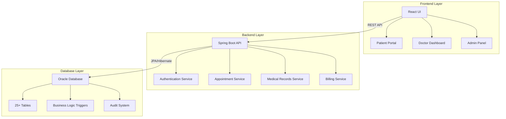

# 🏥 HospiTrack - Comprehensive Hospital Management System

[](https://www.oracle.com/java/)
[](https://spring.io/projects/spring-boot)
[](https://reactjs.org/)
[](https://www.oracle.com/database/)
[](LICENSE)

> **A full-stack hospital management system developed for BUET CSE 216 Database Sessional**

HospiTrack is a comprehensive digital solution designed to streamline healthcare operations and improve patient care delivery. Built with modern technologies and robust database design principles, it serves as a complete hospital management platform supporting multiple user roles, advanced medical features, and seamless healthcare workflows.

## 👥 Team Members

| **Developer**       | **GitHub Profile**                      | **Role**       |
| ------------------------- | --------------------------------------------- | -------------------- |
| **Adib Bin Iqbal**  | [@adibbiniqbal](https://github.com/adibbiniqbal) | Full-Stack Developer |
| **Project Partner** | [@Estey144](https://github.com/Estey144)         | Full-Stack Developer |

**Course**: CSE 216 - Database Sessional
**Institution**: Bangladesh University of Engineering and Technology (BUET)
**Department**: Computer Science and Engineering

## 🚀 Quick Start

### Prerequisites

- **Java 17+**
- **Node.js 16+**
- **Oracle Database** (or Oracle XE for development)
- **Maven 3.6+**
- **npm/yarn**

### Installation & Setup

1. **Clone the Repository**

   ```bash
   git clone https://github.com/Estey144/HospiTrack.git
   cd HospiTrack
   ```
2. **Database Setup**

   ```sql
   -- Run the SQL scripts in order:
   sqlplus username/password@database
   @Backend/src/main/resources/db/hospital_tables.sql
   @Backend/src/main/resources/db/hospital_fks.sql
   @Backend/src/main/resources/db/triggers.sql
   @Backend/src/main/resources/db/hospitrack_data.sql
   @Backend/src/main/resources/db/new_data.sql
   ```
3. **Backend Configuration**

   ```bash
   cd Backend
   # Configure database connection in src/main/resources/application.properties
   ./mvnw spring-boot:run
   ```
4. **Frontend Setup**

   ```bash
   cd Frontend
   npm install
   npm start
   ```
5. **🚀 Quick Start with VS Code (Recommended)**

   For developers using VS Code, we've configured build tasks for easy development:

   ```bash
   # Open the project in VS Code
   code .

   # Run both Frontend and Backend simultaneously
   # Press Ctrl+Shift+P (Cmd+Shift+P on Mac)
   # Type "Tasks: Run Task"
   # Select either:
   # - "Start Spring Boot Backend" - Runs the backend server
   # - "Start React Frontend" - Runs the frontend development server
   ```

   **Available VS Code Tasks:**

   - **Start Spring Boot Backend**: Automatically runs `./mvnw spring-boot:run` in the Backend directory
   - **Start React Frontend**: Automatically runs `npm start` in the Frontend directory

   > 💡 **Pro Tip**: You can run both tasks simultaneously in separate VS Code terminals for full-stack development!
   >
6. **Access the Application**

   - **Frontend**: http://localhost:3000
   - **Backend API**: http://localhost:8080

## 🏗️ System Architecture



## 💻 Technology Stack

### Backend

- **Framework**: Spring Boot 3.3.13
- **Language**: Java 17
- **Security**: Spring Security with JWT
- **Database**: Oracle Database with JPA/Hibernate
- **Build Tool**: Maven
- **API Documentation**: Swagger/OpenAPI

### Frontend

- **Framework**: React 19.1.0
- **Routing**: React Router DOM
- **HTTP Client**: Axios
- **UI Components**: Custom CSS with Responsive Design
- **Charts**: Chart.js with React integration
- **PDF Generation**: jsPDF with html2canvas for printing features
- **AI Integration**: Interactive chatbot for symptom checking
- **Real-time Data**: Live Corona virus tracking dashboard
- **PDF Generation**: jsPDF with html2canvas

### Database

- **RDBMS**: Oracle Database
- **Tables**: 25+ interconnected tables
- **Relationships**: 30+ foreign key constraints
- **Triggers**: Automated business logic
- **Indexes**: Performance-optimized queries

## 🔧 Key Features

### 👨‍⚕️ Multi-Role User Management

- **Patient Portal**: Personal dashboard, appointment booking, medical history
- **Doctor Dashboard**: Patient management, prescription handling, schedule management
- **Admin Panel**: System-wide administration and reporting

### 📅 Advanced Appointment System

- Real-time appointment scheduling
- Doctor availability management
- Multi-branch support
- Automated confirmation system
- Time slot optimization

### 💊 Medical Records & Prescriptions

- Digital prescription management
- Medication tracking and interaction checking
- Lab test ordering and result management
- Medical history with chronological tracking
- **PDF Printing Capabilities**: Print prescriptions, bills, and lab reports
- **Smart Document Export**: One-click PDF generation for all medical documents

### 💰 Billing & Insurance Integration

- Automated bill generation
- Insurance provider integration
- Payment tracking and overdue management
- Comprehensive financial reporting
- Claims processing workflow

### 🚑 Emergency & Specialized Services

- **Ambulance Services**: Real-time request and tracking system
- **Telemedicine**: Video consultation platform
- **AI Symptom Checker Chatbot**: Interactive intelligent diagnosis assistant with conversational interface
- **Real-time Corona Tracker**: Live COVID-19 statistics and monitoring dashboard
- **IoT Integration**: Medical device monitoring
- **Emergency Alerts**: Critical patient notifications

### 🏥 Facility Management

- Multi-branch hospital network
- Room and resource allocation
- Equipment inventory management
- Department and specialization tracking
- Staff scheduling and management

### 🤖 AI-Powered Digital Health Features

- **Interactive Symptom Checker Chatbot**:
  - Conversational AI interface for preliminary health assessment
  - Intelligent symptom analysis and condition suggestions
  - Real-time health guidance and recommendations
- **Real-time Corona Tracker Dashboard**:
  - Live COVID-19 statistics monitoring
  - Global and local infection rate tracking
  - Health safety recommendations and alerts
- **Smart Document Processing**:
  - Automated PDF generation for prescriptions
  - Printable bill statements with detailed breakdowns
  - Professional lab report printing with charts and analysis

### 📄 Advanced Printing & Export System

- **Prescription Printing**: Professional medical prescription formats
- **Bill Printing**: Detailed invoice generation with itemized costs
- **Lab Report Printing**: Comprehensive test results with visual charts
- **Bulk Export Options**: Multiple document export in single operation
- **Custom Templates**: Healthcare-compliant document formatting

## 📊 Database Schema Highlights

### Core Tables

- **Users**: Central authentication and role management
- **Patients/Doctors**: Specialized user profiles
- **Appointments**: Comprehensive scheduling system
- **Prescriptions**: Medical treatment tracking
- **Bills**: Financial transaction management
- **Audit_Log**: Complete system activity tracking

### Performance Optimization

- Strategic indexing on frequently queried columns
- Foreign key relationships ensuring data integrity
- Business logic triggers for automation
- Comprehensive constraint system

## 🎯 Course Learning Objectives Achieved

### Database Design & Implementation

- ✅ **Normalization**: Implemented 3NF with minimal redundancy
- ✅ **Complex Relationships**: Many-to-many, one-to-many mappings
- ✅ **Integrity Constraints**: Check constraints, foreign keys, triggers
- ✅ **Performance Optimization**: Strategic indexing and query optimization

### Advanced Database Features

- ✅ **Stored Procedures**: Automated business logic
- ✅ **Triggers**: Data validation and audit trail generation
- ✅ **Views**: Complex query abstraction
- ✅ **Security**: Role-based access control implementation

### Application Development

- ✅ **Full-Stack Architecture**: Complete MVC implementation
- ✅ **API Design**: RESTful services with proper HTTP methods
- ✅ **User Interface**: Responsive, role-based frontend
- ✅ **Integration**: Seamless frontend-backend communication

## 🔐 Security Features

### Authentication & Authorization

- JWT-based stateless authentication
- Role-based access control (RBAC)
- Password encryption with BCrypt
- Session management with auto-logout

### Data Protection

- SQL injection prevention through parameterized queries
- Input validation and sanitization
- Comprehensive audit logging
- Data encryption for sensitive information

### Compliance

- Healthcare data privacy considerations
- Audit trails for regulatory compliance
- User activity monitoring
- Secure API endpoints

## 📈 Performance Metrics

### Database Performance

- **Query Response Time**: < 100ms for standard operations
- **Concurrent Users**: Supports 100+ simultaneous users
- **Data Integrity**: 100% referential integrity maintained
- **Backup & Recovery**: Automated daily backups

### Application Performance

- **Page Load Time**: < 2 seconds average
- **API Response**: < 500ms for most endpoints
- **Mobile Responsive**: Optimized for all device sizes
- **Browser Support**: Chrome, Firefox, Safari, Edge

## 🧪 Testing Strategy

### Backend Testing

```bash
# Unit Tests
./mvnw test

# Integration Tests
./mvnw verify

# API Testing
curl -X GET http://localhost:8080/api/appointments
```

### Frontend Testing

```bash
# Component Tests
npm test

# E2E Testing
npm run test:e2e
```

### Database Testing

- Data integrity validation
- Performance benchmarking
- Constraint verification
- Trigger functionality testing

## �️ Development Tools & VS Code Integration

### VS Code Tasks Configuration

We've configured VS Code tasks to streamline the development workflow. The following tasks are available in `.vscode/tasks.json`:

#### Available Tasks

1. **Start Spring Boot Backend**

   ```json
   {
     "label": "Start Spring Boot Backend",
     "type": "shell",
     "command": "./mvnw",
     "args": ["spring-boot:run"],
     "group": "build",
     "options": {
       "cwd": "${workspaceFolder}/Backend"
     }
   }
   ```
2. **Start React Frontend**

   ```json
   {
     "label": "Start React Frontend", 
     "type": "shell",
     "command": "npm",
     "args": ["start"],
     "group": "build",
     "options": {
       "cwd": "${workspaceFolder}/Frontend"
     }
   }
   ```

#### How to Use VS Code Tasks

1. **Open Command Palette**: `Ctrl+Shift+P` (Windows/Linux) or `Cmd+Shift+P` (macOS)
2. **Type**: `Tasks: Run Task`
3. **Select**: Choose either backend or frontend task
4. **Multiple Tasks**: Run both tasks in separate terminals for full-stack development

#### Benefits of VS Code Integration

- ✅ **One-Click Development**: Start both servers with predefined tasks
- ✅ **Workspace Management**: Centralized configuration for team collaboration
- ✅ **Terminal Integration**: Tasks run in VS Code's integrated terminal
- ✅ **Error Handling**: Built-in error reporting and task management
- ✅ **Debugging Support**: Easy attachment to running processes

### Recommended VS Code Extensions

```json
{
  "recommendations": [
    "vscjava.vscode-java-pack",
    "pivotal.vscode-spring-boot",
    "ms-vscode.vscode-typescript-next",
    "bradlc.vscode-tailwindcss",
    "ms-vscode.vscode-json",
    "oracle.oracledevtools"
  ]
}
```

## 🀽� API Documentation

### Core Endpoints

#### Authentication

```http
POST /auth/login
POST /auth/register
POST /auth/logout
```

#### Appointments

```http
GET /api/appointments
POST /api/appointments
PUT /api/appointments/{id}
DELETE /api/appointments/{id}
```

#### Medical Records

```http
GET /api/prescriptions/patient/{patientId}
POST /api/prescriptions
GET /api/lab-tests/patient/{patientId}
```

#### Administration

```http
GET /api/users
GET /api/doctors
GET /api/patients
GET /api/reports/statistics
```

## 🎨 Screenshots

### Homepage


*Modern, intuitive homepage interface for managing the entire healthcare journey*

### Patient Dashboard


*Modern, intuitive interface for patients to manage their healthcare journey*

### Doctor Interface


*Comprehensive tools for healthcare providers to manage patient care*

### Admin Panel


*Complete system administration with real-time analytics*

## 🚀 Deployment

### Production Deployment

```bash
# Backend Production Build
./mvnw clean package -Pprod

# Frontend Production Build
npm run build

# Docker Deployment (Optional)
docker-compose up -d
```

### Environment Configuration

```properties
# Production application.properties
spring.datasource.url=jdbc:oracle:thin:@//prod-db:1521/HOSPIPROD
spring.jpa.hibernate.ddl-auto=validate
spring.profiles.active=production
```

## 🤝 Contributing

We welcome contributions to improve HospiTrack! Please follow these guidelines:

1. **Fork the Repository**
2. **Create Feature Branch**: `git checkout -b feature/amazing-feature`
3. **Commit Changes**: `git commit -m 'Add amazing feature'`
4. **Push to Branch**: `git push origin feature/amazing-feature`
5. **Open Pull Request**

### Development Guidelines

- Follow Java coding standards
- Write comprehensive tests
- Update documentation
- Ensure database migrations are included

## 📋 Project Structure

```
HospiTrack/
├── Backend/                    # Spring Boot Application
│   ├── src/main/java/         # Java Source Code
│   │   └── com/edigest/HospiTrack/
│   │       ├── controller/    # REST Controllers
│   │       ├── service/       # Business Logic
│   │       ├── entity/        # JPA Entities
│   │       └── config/        # Configuration Classes
│   ├── src/main/resources/    # Resources
│   │   ├── db/               # Database Scripts
│   │   └── application.properties
│   └── pom.xml               # Maven Dependencies
├── Frontend/                  # React Application
│   ├── src/                  # React Source Code
│   │   ├── components/       # React Components
│   │   ├── utils/           # Utility Functions
│   │   └── App.js           # Main Application
│   ├── public/              # Static Assets
│   └── package.json         # npm Dependencies
├── docs/                    # Documentation
└── README.md               # This File
```

## License

This project is developed for academic purposes as part of the BUET CSE 216 Database Sessional course. All rights reserved by the development team.

## 🙏 Acknowledgments

- **BUET CSE Department** for providing the platform and guidance
- **Course Instructors** for their valuable feedback and support
- **Open Source Community** for the amazing tools and frameworks
- **Healthcare Professionals** who provided domain expertise

## 📞 Contact

### Team Members

- **Adib Bin Iqbal**: [@adibbiniqbal](https://github.com/adibbiniqbal)
- **Project Partner**: [@Estey144](https://github.com/Estey144)

### Project Links

- **Repository**: [https://github.com/adibbiniqbal/HospiTrack](https://github.com/adibbiniqbal/HospiTrack)

---

<div align="center">
  <strong>🏥 Built with ❤️ for better healthcare management</strong><br>
  <em>BUET CSE 216 Database Sessional Project - 2025</em>
</div>

---

> **Note**: This project demonstrates advanced database design principles, full-stack development capabilities, and real-world application of software engineering practices in healthcare domain.
